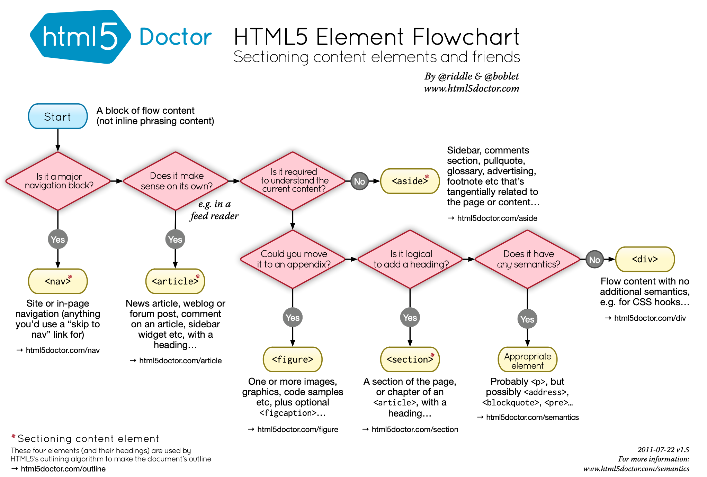

# Philip-DiPaula-OSU-bootcamp-hwk1

## These are the files for the first OSU Web Development Bootcamp Homework Assignment

Here is a [link](https://pjdip.github.io/Philip-DiPaula-OSU-bootcamp-hwk1/) to the live page :D

The goals of this assignment were manifold. We wanted to make a website meet accessibility standards using html and get comfortable with styling a web page using css. In addition, we wanted to get comfortable using github and the terminal.

* [Installation](#installation)
* [Usage](#usage)
* [Credits](#credits)
* [Badges](#badges)
* [Contributing](#contributing)
* [License](#license)

## Installation

The only thing you will need to have installed in order to run the index.html file is a functioning web browser. It should work with most versions of most browswers. I recommend the Brave browser, as you will be paid in the Basic Attention Token (BAT) for viewing ads, instead of being bombarded with ads and getting nothing for it.

## Usage 

In order to use this project, simply open the index.html in your favorite browser. There is limited functionality due to the fact that the website has no javascript to run behind the scenes. But isn't it so pretty? One thing you can do is click on the navigation bar items at the top of the page in order to be redirected to the corresponding sectinos.

The following image shows the nav bar :D

## Credits

Special Thanks to Mozilla Developer Network for a little clarification on [semantic](https://developer.mozilla.org/en-US/docs/Glossary/Semantics) elements and understanding [accessibility](https://developer.mozilla.org/en-US/docs/Learn/Tools_and_testing/Cross_browser_testing/Accessibility)

Flowchart was helpful in converting divs to semantic elements:

Special Thanks to [ChilledCow](https://www.youtube.com/channel/UCSJ4gkVC6NrvII8umztf0Ow) for providing chill lofi beats to code to

Thanks to [github guides](https://guides.github.com/features/mastering-markdown/#syntax) for assistance with markdown syntax

## Badges

## Contributing

If you wish to contribute, please follow these guidelines
[Contributor Covenant](https://www.contributor-covenant.org/)

## License

Licensed under the [GNU General Public License v3.0](https://choosealicense.com/licenses/gpl-3.0/)

---